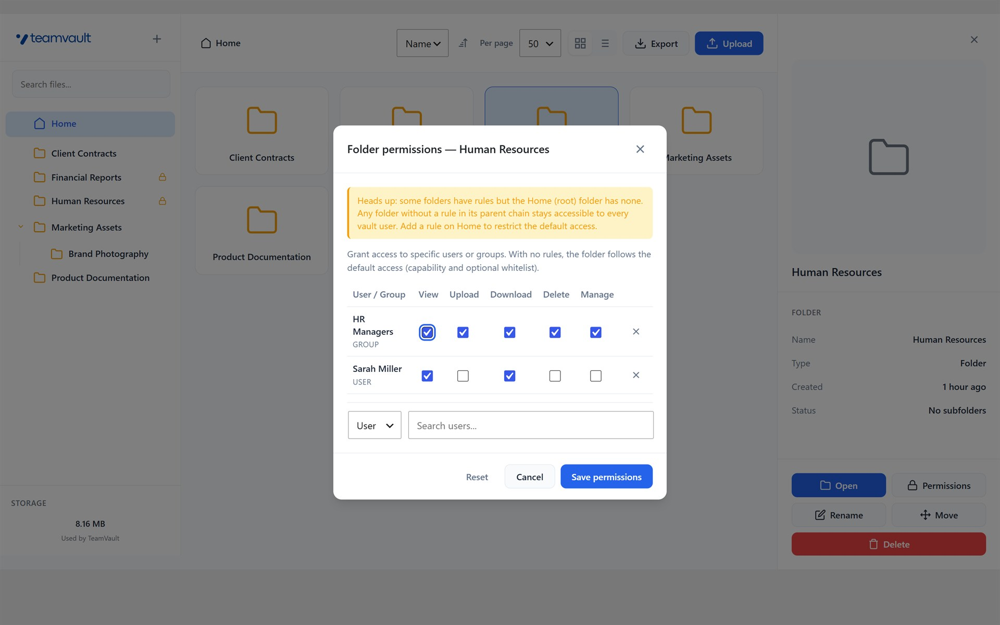
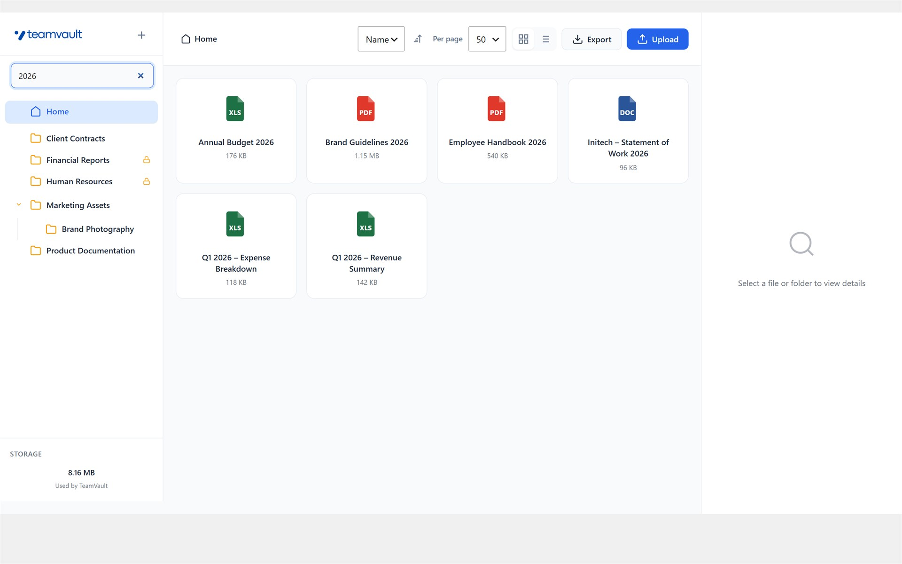
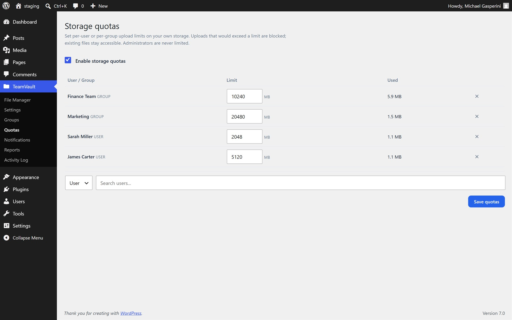
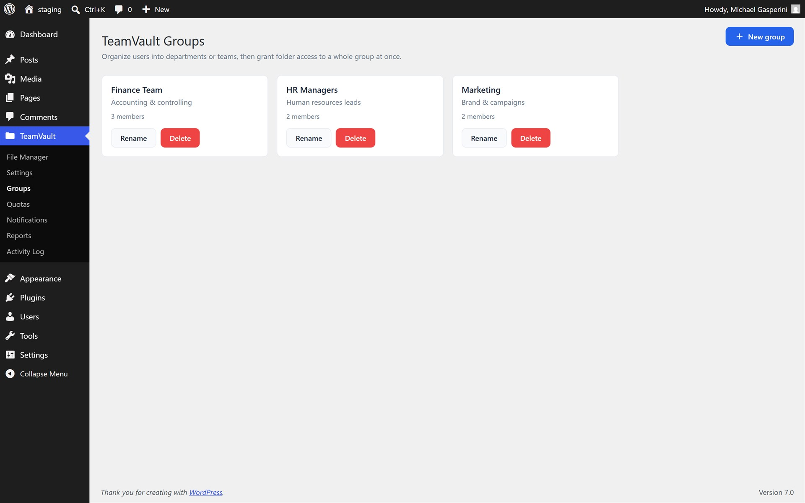
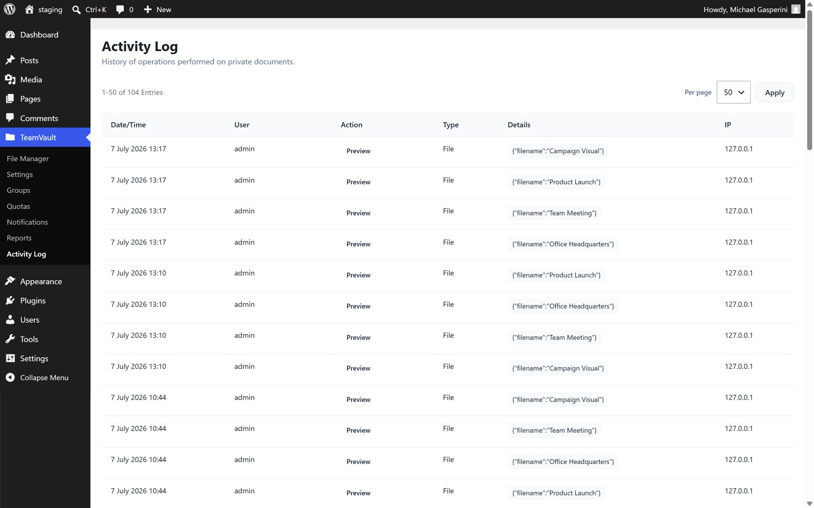
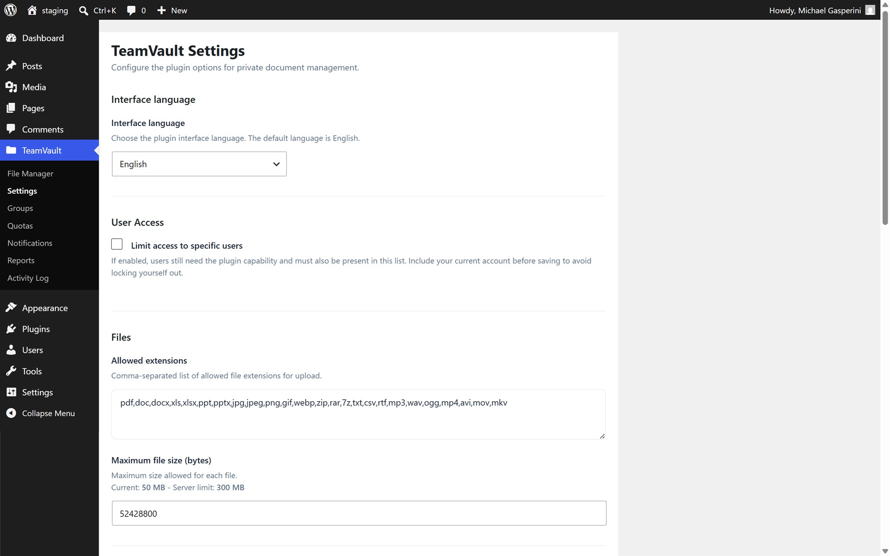

# Mikesoft TeamVault

[](https://github.com/TheStreamCode/mikesoft-teamvault/actions/workflows/ci.yml)
[](https://wordpress.org/plugins/mikesoft-teamvault/)
[](https://wordpress.org/plugins/mikesoft-teamvault/)
[](https://www.php.net/)
[](LICENSE)
[](https://github.com/sponsors/TheStreamCode)

[English](README.md) · [Italiano](README.it.md) · **Français** · [Español](README.es.md) · [Deutsch](README.de.md)

Espace de travail documentaire privé pour les équipes, agences et services d'exploitation WordPress qui ont besoin d'un partage de fichiers contrôlé en dehors de la Médiathèque.

Version actuelle du plugin : `3.2.3`.

Disponible directement sur WordPress.org et maintenu pour les versions actuelles de WordPress.

Si TeamVault vous est utile, envisagez de [parrainer le projet sur GitHub](https://github.com/sponsors/TheStreamCode) — il est développé et maintenu gratuitement, et les parrainages contribuent à le faire vivre.

## Vue d'ensemble

Mikesoft TeamVault ajoute un espace de travail documentaire privé au sein de l'administration WordPress.
Il est conçu pour les équipes qui ont besoin d'organiser, de prévisualiser, d'exporter et de partager des fichiers sensibles sans les exposer via les URL habituelles de la Médiathèque.

Les fichiers sont conservés dans un stockage protégé et distribués par des gestionnaires WordPress authentifiés plutôt que par des URL de médias publiques.


| Autorisations par dossier | Recherche dans le coffre | Quotas de stockage |
| :---: | :---: | :---: |
| [](.wordpress-org/assets/screenshot-2.jpg) | [](.wordpress-org/assets/screenshot-3.jpg) | [](.wordpress-org/assets/screenshot-4.jpg) |
| **Groupes** | **Journal d'activité** | **Réglages** |
| [](.wordpress-org/assets/screenshot-5.jpg) | [](.wordpress-org/assets/screenshot-6.jpg) | [](.wordpress-org/assets/screenshot-7.jpg) |

Les cas d'usage typiques incluent :

- documents internes de l'entreprise
- livraison de documents d'agence à client depuis l'administration WordPress
- échanges de fichiers avec des partenaires ou des fournisseurs
- archives de back-office qui doivent rester en dehors de la Médiathèque publique

Les fonctionnalités principales incluent :

- stockage privé en dehors du flux de travail habituel de la Médiathèque
- accès partagé pour les utilisateurs internes autorisés
- opérations de création, de renommage, de déplacement et de suppression de dossiers
- téléversements par glisser-déposer avec validation des fichiers
- aperçu intégré pour les types de fichiers pris en charge, y compris les PDF
- export ZIP pour les dossiers ou pour l'ensemble de la bibliothèque de documents
- journalisation de l'activité pour la traçabilité opérationnelle
- outils de maintenance pour le nettoyage des orphelins et la réindexation du stockage

Fonctionnalités de gouvernance (toutes gratuites, depuis la 2.6) :

- groupes TeamVault pour organiser les utilisateurs en départements ou en équipes, indépendamment des rôles WordPress
- autorisations par dossier avec des actions granulaires (consulter, téléverser, télécharger, supprimer, gérer) pour les utilisateurs et les groupes, avec héritage et substitutions explicites au niveau des sous-dossiers
- accès en aperçu seul qui autorise la consultation sans téléchargement ni export ZIP
- quotas de stockage par utilisateur et par groupe appliqués avant le téléversement
- rapports d'accès (qui a consulté ou téléchargé quoi) avec filtres et export CSV du journal d'activité
- notifications par e-mail pour les événements de téléversement, de téléchargement, de suppression et d'accès refusé

## Dernière version

La version `3.2.3` renforce la validation des téléversements et des aperçus intégrés, rend transactionnelles les mises à jour des autorisations et des groupes, et préserve la cohérence des opérations sur les fichiers, dossiers, quotas et exports lorsqu'une écriture dans le stockage ou la base de données échoue. Les dossiers enfants partagés explicitement restent accessibles lorsque leur parent est masqué, les exports CSV du journal sont plus sûrs à ouvrir dans un tableur, les nouvelles installations utilisent de nouveau la langue Automatique par défaut et l'écran des extensions identifie désormais l'auteur simplement comme Mikesoft.

La version `3.2.2` renouvelle les **icônes de type de fichier** dans tout le gestionnaire de fichiers : les fichiers PDF, Word, Excel, PowerPoint, CSV, texte, archive, audio, vidéo et image affichent désormais des badges colorés clairs et reconnaissables avec l'étiquette du format — dans la grille, la vue en liste et l'aperçu du panneau de détails — à la place des anciens glyphes monochromes.

La version `3.0.0` constitue une étape majeure en matière de sécurité et de fiabilité. Les résultats de recherche sont désormais filtrés par le moteur d'autorisations par dossier, de sorte que les utilisateurs restreints ne peuvent plus découvrir les noms de fichiers ou les métadonnées des dossiers qu'ils ne sont pas autorisés à consulter. Le fichier `.htaccess` de stockage généré refuse l'accès direct sur Apache 2.4 en plus d'Apache 2.2 et IIS, et les quotas de stockage sont appliqués à l'aide d'un verrou de base de données afin que des téléversements concurrents ne puissent pas dépasser conjointement une limite. Les téléchargements et les aperçus intégrés gagnent la prise en charge des plages HTTP (`Accept-Ranges` / `206 Partial Content`) pour les transferts reprenables et les lecteurs PDF à navigation par plage sur les fichiers volumineux. La boîte de dialogue des autorisations de dossier avertit désormais lorsque des règles existent mais que la racine n'en possède aucune, l'icône du menu d'administration s'aligne sur le style natif de WordPress, et le JavaScript d'administration a été scindé en modules ciblés sans changement de comportement.

La version `2.6` a introduit la **suite de gouvernance** documentaire gratuite : groupes TeamVault, autorisations par dossier avec héritage et actions granulaires (consulter, téléverser, télécharger, supprimer, gérer), accès en aperçu seul, quotas de stockage par utilisateur et par groupe, rapports d'accès avec export CSV, notifications par e-mail. Les installations existantes ne sont pas affectées, car les dossiers dépourvus de règles conservent le comportement antérieur.

Pourquoi les équipes adoptent TeamVault :

- il crée un espace documentaire privé dédié au lieu de surcharger la Médiathèque
- il ajoute un contrôle d'accès fondé sur les capacités avec une couche de liste blanche optionnelle, ainsi que des autorisations par dossier et des groupes pour une gouvernance plus fine
- il maintient les flux de travail d'export, de maintenance et de récupération centrés sur les fichiers opérationnels

## Prérequis

- WordPress 6.0 ou version ultérieure
- PHP 8.0 ou version ultérieure
- Chemin de stockage inscriptible pour les documents privés
- `ZipArchive` disponible sur le serveur pour les fonctionnalités d'export

## Installation

### Recommandée

Installez le plugin depuis le [répertoire des plugins WordPress.org](https://wordpress.org/plugins/mikesoft-teamvault/) afin que le site reçoive les notifications de mise à jour standard.

1. Dans l'administration WordPress, allez dans `Plugins > Add New`.
2. Recherchez `Mikesoft TeamVault`.
3. Cliquez sur `Install Now` et activez le plugin.
4. Ouvrez `TeamVault > Settings` pour examiner les règles d'accès, de stockage et de fichiers.

### Manuelle

1. Téléchargez le paquet de version depuis WordPress.org.
2. Téléversez-le dans `wp-content/plugins/mikesoft-teamvault/`.
3. Activez le plugin depuis l'écran des plugins.

## Modèle d'accès

- L'accès à l'espace de travail des fichiers utilise la capacité `manage_private_documents`.
- Les nouvelles activations accordent cette capacité aux administrateurs uniquement.
- La capacité `manage_private_documents` accorde un accès complet à l'espace de travail TeamVault, y compris les actions de téléversement, de renommage, de déplacement, de téléchargement, d'export et de suppression.
- Le mode liste blanche optionnel ajoute une seconde couche d'autorisation pour des utilisateurs sélectionnés.
- Les autorisations par dossier (depuis la 2.6) ajoutent un contrôle fin par-dessus la capacité : lorsqu'un dossier possède des règles explicites, l'accès est limité aux utilisateurs/groupes et aux actions autorisés, avec héritage depuis les dossiers parents ; les dossiers dépourvus de règles conservent le comportement fondé sur la capacité. Les administrateurs conservent toujours un accès complet.
- Les réglages, les groupes, les quotas, les notifications, les rapports, les journaux d'activité, la gestion de la liste blanche, les outils de maintenance et les contrôles des données de désinstallation requièrent `manage_options`.

Lorsque le mode liste blanche est activé, conservez le compte administrateur courant dans la liste des utilisateurs autorisés avant d'enregistrer les réglages.
Sur les sites mis à niveau depuis d'anciennes versions, examinez les capacités de rôle et les réglages de liste blanche existants si les éditeurs avaient auparavant accès à TeamVault.

## Stockage

- Chemin de stockage par défaut : `wp-content/uploads/private-documents/`
- Le plugin peut utiliser un chemin inscriptible personnalisé configuré dans les réglages.
- Le stockage est protégé par des fichiers de refus au niveau serveur là où c'est pris en charge.
- Apache/LiteSpeed peuvent appliquer le fichier `.htaccess` généré ; IIS peut appliquer `web.config` ; Nginx nécessite une règle serveur équivalente qui refuse les requêtes directes vers `/wp-content/uploads/private-documents/`.
- Pour les déploiements à haute sensibilité, préférez un chemin de stockage personnalisé situé en dehors de la racine web publique.
- Le widget de stockage de la barre latérale n'affiche que l'espace utilisé par les fichiers TeamVault, afin d'éviter d'exposer des valeurs de quota d'hébergement trompeuses sur les environnements mutualisés.

Si un site est migré sans copier le dossier de stockage privé, les enregistrements TeamVault peuvent subsister dans la base de données alors que les binaires d'origine sont manquants. L'écran des réglages inclut des outils de nettoyage et de réindexation pour ces scénarios.

## Assistance

- Assistance aux utilisateurs finaux : [forum d'assistance WordPress.org](https://wordpress.org/support/plugin/mikesoft-teamvault/)
- E-mail : [teamvault@mikesoft.it](mailto:teamvault@mikesoft.it)
- Site web : [mikesoft.it](https://mikesoft.it)
- Signalements de sécurité : voir [SECURITY.md](SECURITY.md)
- Soutenir la maintenance open source continue : [GitHub Sponsors](https://github.com/sponsors/TheStreamCode)

## Vérification rapide pour le développement

Installez les dépendances de développement avec Composer, puis exécutez les commandes de validation standard :

```bash
composer install
composer lint
composer test
composer ci
```

`composer lint` vérifie tous les fichiers PHP du dépôt en dehors des dépendances générées. `composer test` exécute la suite PHPUnit légère avec le bootstrap du dépôt. GitHub Actions exécute également WordPress Plugin Check sur une build d'exécution propre du plugin.

## Guide du dépôt

Ce dépôt est le miroir public des sources du plugin.

- Les informations sur le produit et l'installation destinées aux utilisateurs de WordPress.org se trouvent dans [`readme.txt`](readme.txt).
- L'historique complet des versions se trouve dans [`changelog.txt`](changelog.txt).
- Les politiques du dépôt se trouvent dans [`CONTRIBUTING.md`](CONTRIBUTING.md), [`CODE_OF_CONDUCT.md`](CODE_OF_CONDUCT.md) et [`SECURITY.md`](SECURITY.md).
- Les notes des mainteneurs et des développeurs se trouvent dans [`docs/`](docs/).

## Ressources de marque

- `.wordpress-org/assets/icon-256x256.png` est l'icône principale en couleurs pour la fiche WordPress.org.
- `.wordpress-org/assets/icon.svg` est la ressource vectorielle complémentaire pour la fiche WordPress.org.
- `.wordpress-org/assets/screenshot-1.jpg` est la capture d'écran principale du gestionnaire de fichiers utilisée par la fiche WordPress.org et par ce README.
- `assets/logo-teamvault.svg` est le logo d'administration intégré utilisé au sein de l'interface TeamVault.

Ces ressources s'adressent à des surfaces différentes et doivent rester alignées sur la même marque sans forcer l'interface d'exécution du plugin à se conformer aux contraintes d'empaquetage de WordPress.org.

## Carte de la documentation

- [`docs/developer/hooks.md`](docs/developer/hooks.md) - hooks et filtres pour développeurs
- [`docs/maintainer/local-development.md`](docs/maintainer/local-development.md) - flux de travail de développement local
- [`docs/maintainer/release.md`](docs/maintainer/release.md) - processus de publication sur WordPress.org

## Licence

GPL v2 ou version ultérieure. Voir [LICENSE](LICENSE).
