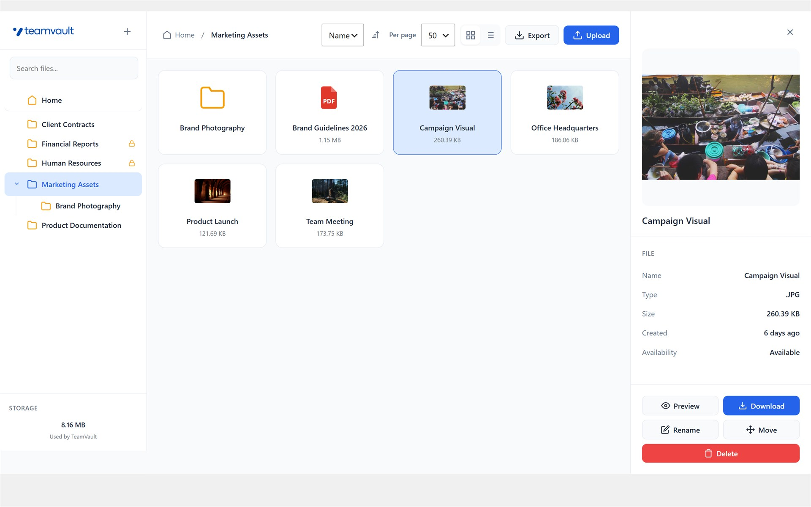

# Mikesoft TeamVault

[](https://github.com/TheStreamCode/mikesoft-teamvault/actions/workflows/ci.yml)

Private document workspace for WordPress teams, agencies, and operations that need controlled file sharing outside the Media Library.

## Overview

Mikesoft TeamVault adds a private document workspace inside the WordPress admin.
It is designed for teams that need to organize, preview, export, and share sensitive files without exposing them through normal Media Library URLs.

Files are stored in protected storage and delivered through authenticated WordPress handlers instead of public media URLs.



Typical use cases include:

- internal company documents
- agency-to-client document delivery from WordPress admin
- partner or vendor file exchanges
- back-office archives that should stay out of the public Media Library

Core capabilities include:

- private storage outside the normal Media Library workflow
- shared access for authorized internal users
- folder creation, rename, move, and delete operations
- drag-and-drop uploads with file validation
- inline preview for supported file types, including PDFs
- ZIP export for folders or the full document library
- activity logging for operational traceability
- maintenance tools for orphan cleanup and storage reindex

Why teams adopt TeamVault:

- it creates a dedicated private document area instead of overloading the Media Library
- it adds capability-based access control with an optional whitelist layer
- it keeps export, maintenance, and recovery workflows focused on operational files

## Requirements

- WordPress 6.0 or later
- PHP 8.0 or later
- Writable storage path for private documents
- `ZipArchive` available on the server for export features

## Installation

### Recommended

Install the plugin from the [WordPress.org Plugin Directory](https://wordpress.org/plugins/mikesoft-teamvault/) so the site receives standard update notifications.

1. In WordPress admin, go to `Plugins > Add New`.
2. Search for `Mikesoft TeamVault`.
3. Click `Install Now` and activate the plugin.
4. Open `TeamVault > Settings` to review access, storage, and file rules.

### Manual

1. Download the release package from WordPress.org.
2. Upload it to `wp-content/plugins/mikesoft-teamvault/`.
3. Activate the plugin from the Plugins screen.

## Access Model

- File workspace access uses the `manage_private_documents` capability.
- Administrators and Editors receive that capability on activation.
- Optional whitelist mode adds a second authorization layer for selected users.
- Settings, activity logs, whitelist management, maintenance tools, and uninstall data controls require `manage_options`.

When whitelist mode is enabled, keep the current administrator account in the allowed users list before saving settings.

## Storage

- Default storage path: `wp-content/uploads/private-documents/`
- The plugin can use a custom writable path configured in settings.
- Storage is protected with server-level deny files where supported.
- The sidebar storage widget shows only the space used by TeamVault files, to avoid exposing misleading hosting quota values on shared environments.

If a site is migrated without copying the private storage folder, TeamVault records may remain in the database while the original binaries are missing. The settings screen includes cleanup and reindex tools for those scenarios.

## Support

- End-user support: [WordPress.org support forum](https://wordpress.org/support/plugin/mikesoft-teamvault/)
- Website: [mikesoft.it](https://mikesoft.it)
- Security reports: see [SECURITY.md](SECURITY.md)

## Development Quick Check

Install development dependencies with Composer, then run the standard validation commands:

```bash
composer install
composer lint
composer test
composer ci
```

`composer lint` checks all repository PHP files outside generated dependencies. `composer test` runs the lightweight PHPUnit suite with the repository bootstrap. GitHub Actions also runs WordPress Plugin Check against a clean runtime build of the plugin.

## Repository Guide

This repository is the public source mirror for the plugin.

- Product and installation information for WordPress.org users lives in [`readme.txt`](readme.txt).
- Full release history lives in [`changelog.txt`](changelog.txt).
- Repository policies live in [`CONTRIBUTING.md`](CONTRIBUTING.md) and [`SECURITY.md`](SECURITY.md).
- Maintainer and developer notes live in [`docs/`](docs/).

## Branding Assets

- `.wordpress-org/assets/icon-256x256.png` is the primary full-color icon for the WordPress.org listing.
- `.wordpress-org/assets/icon.svg` is the scalable companion asset for the WordPress.org listing.
- `.wordpress-org/assets/screenshot-1.jpg` is the primary file manager screenshot used by the WordPress.org listing and this README.
- `assets/logo-teamvault.svg` is the in-plugin admin logo used inside the TeamVault interface.

These assets serve different surfaces and should stay aligned to the same brand without forcing the runtime plugin UI to match WordPress.org packaging constraints.

## Documentation Map

- [`docs/developer/hooks.md`](docs/developer/hooks.md) - developer hooks and filters
- [`docs/maintainer/local-development.md`](docs/maintainer/local-development.md) - local development workflow
- [`docs/maintainer/release.md`](docs/maintainer/release.md) - WordPress.org release process

## License

GPL v2 or later. See [LICENSE](LICENSE).
