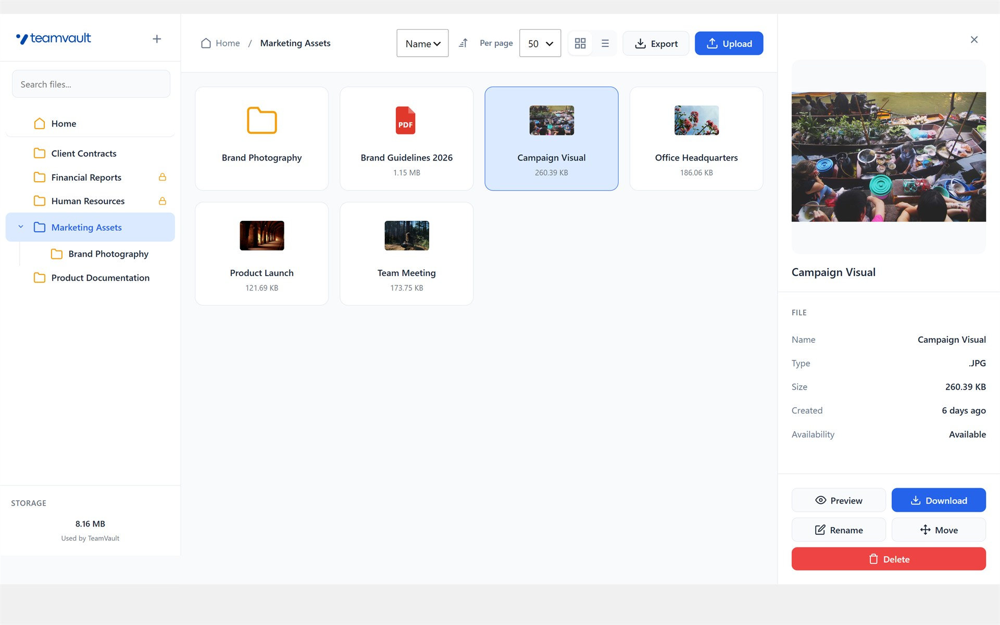
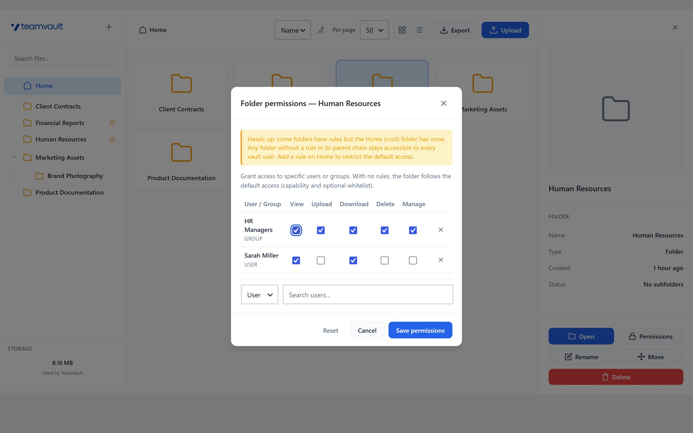
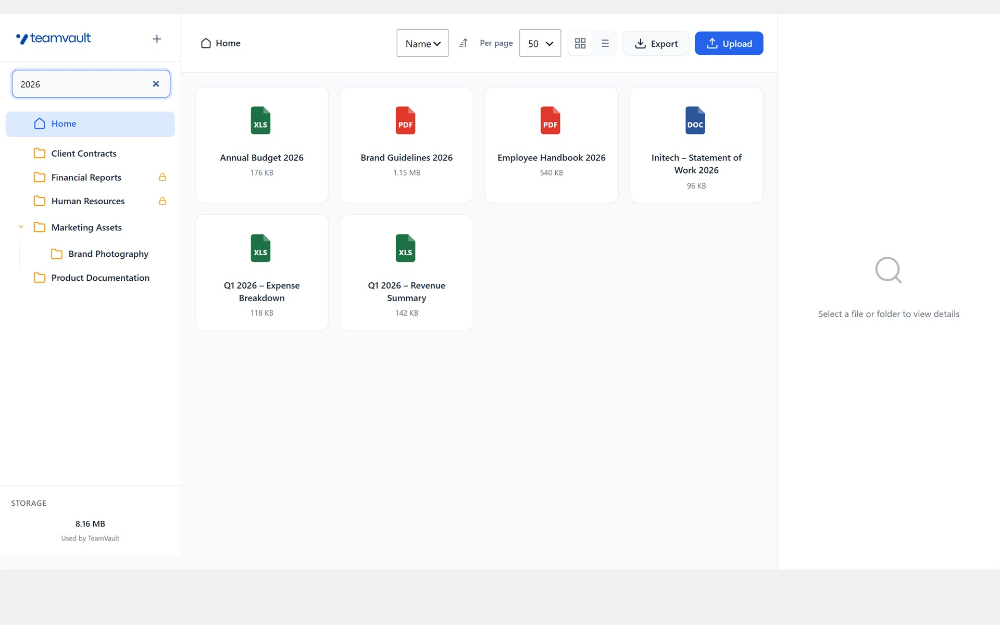
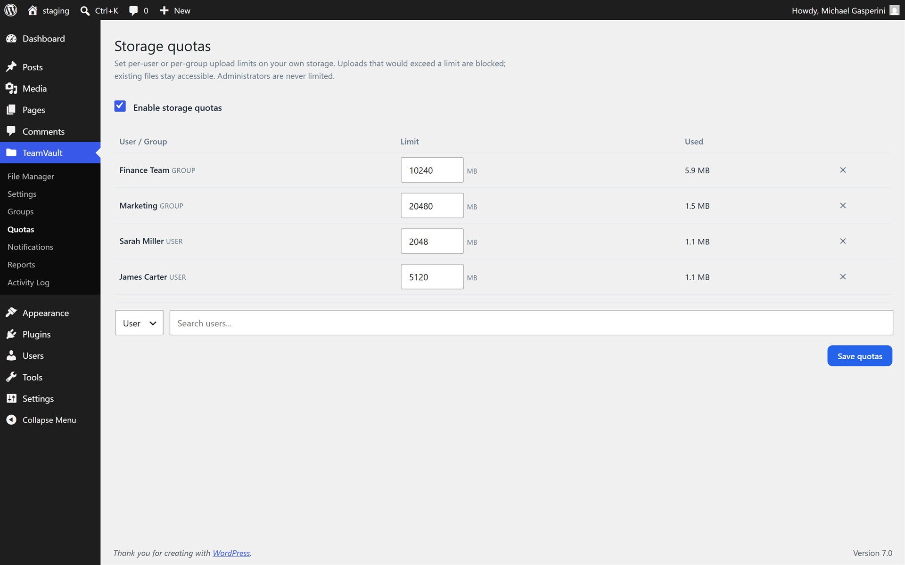
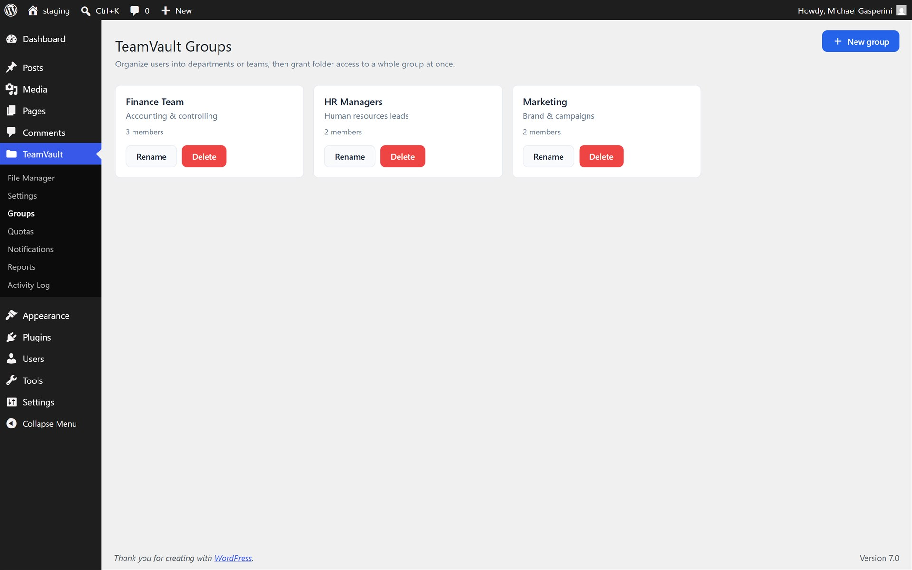
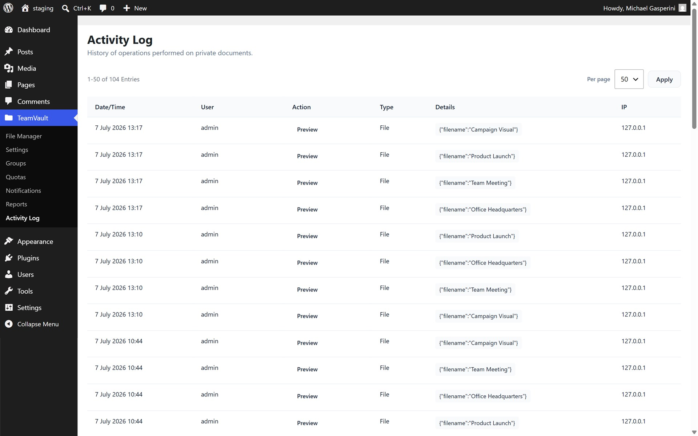
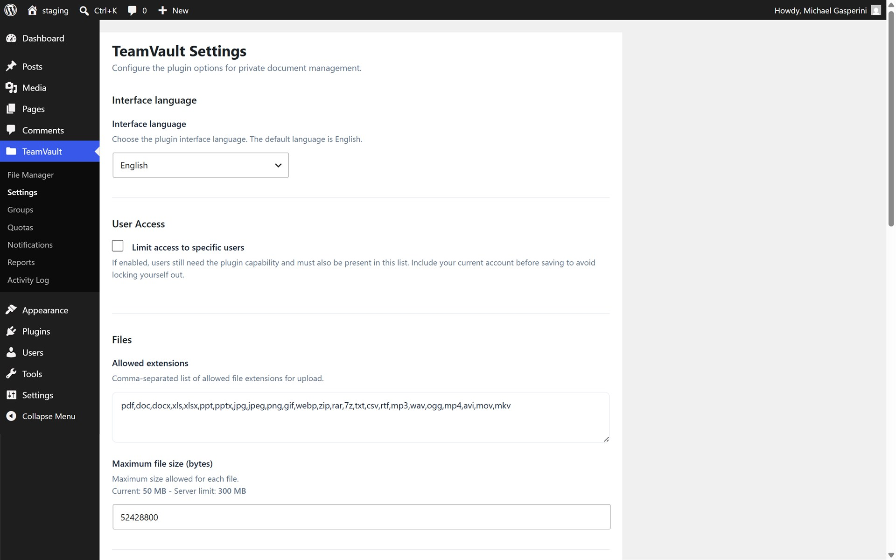

# Mikesoft TeamVault

[](https://github.com/TheStreamCode/mikesoft-teamvault/actions/workflows/ci.yml)
[](https://wordpress.org/plugins/mikesoft-teamvault/)
[](https://wordpress.org/plugins/mikesoft-teamvault/)
[](https://www.php.net/)
[](LICENSE)
[](https://github.com/sponsors/TheStreamCode)

**English** · [Italiano](README.it.md) · [Français](README.fr.md) · [Español](README.es.md) · [Deutsch](README.de.md)

Private document workspace for WordPress teams, agencies, and operations that need controlled file sharing outside the Media Library.

Current plugin version: `3.2.5`.

Available directly from WordPress.org and maintained against current WordPress releases.

If TeamVault is useful to you, consider [sponsoring the project on GitHub](https://github.com/sponsors/TheStreamCode) — it is developed and maintained for free, and sponsorships help keep it going.

## Overview

Mikesoft TeamVault adds a private document workspace inside the WordPress admin.
It is designed for teams that need to organize, preview, export, and share sensitive files without exposing them through normal Media Library URLs.

Files are stored in protected storage and delivered through authenticated WordPress handlers instead of public media URLs.



| Per-folder permissions | Search across the vault | Storage quotas |
| :---: | :---: | :---: |
| [](.wordpress-org/assets/screenshot-2.jpg) | [](.wordpress-org/assets/screenshot-3.jpg) | [](.wordpress-org/assets/screenshot-4.jpg) |
| **Groups** | **Activity log** | **Settings** |
| [](.wordpress-org/assets/screenshot-5.jpg) | [](.wordpress-org/assets/screenshot-6.jpg) | [](.wordpress-org/assets/screenshot-7.jpg) |

Typical use cases include:

- internal company documents
- agency-to-client document delivery from WordPress admin
- partner or vendor file exchanges
- back-office archives that should stay out of the public Media Library

Core capabilities include:

- private storage outside the normal Media Library workflow
- shared access for authorized internal users
- folder creation, rename, move, and delete operations
- drag-and-drop uploads with file validation
- inline preview for supported file types, including PDFs
- ZIP export for folders or the full document library
- activity logging for operational traceability
- maintenance tools for orphan cleanup and storage reindex

Governance capabilities (all free, since 2.6):

- TeamVault groups to organize users into departments or teams, independent from WordPress roles
- per-folder permissions with granular actions (view, upload, download, delete, manage) for users and groups, with inheritance and explicit child overrides
- preview-only access that allows viewing without download or ZIP export
- per-user and per-group storage quotas enforced before upload
- access reports (who viewed or downloaded what) with filters and a CSV export of the activity log
- email notifications for upload, download, delete, and access-denied events

## Latest Release

Version `3.2.5` completes the output-encoding pass started in 3.2.4: the file details panel now escapes the stored file extension before rendering it. The value is already restricted to `[a-z0-9]` by upload and reindex validation, so this is defense in depth rather than a fixed exploit. No configuration changes are required.

Version `3.2.4` hardens private file delivery by preserving no-cache headers and keeping storage paths out of diagnostic logs. Browser destinations are restricted to same-origin HTTP(S), the interface-language setting uses an explicit allowlist, and repeated permission checks reuse request-scoped folder, rule, and group lookups. CI, packaging filters, security guidance, and development/release documentation have also been strengthened. No configuration changes are required.

Version `3.2.3` strengthens upload and inline-preview validation, makes permission and group updates transactional, and keeps file, folder, quota, and export operations consistent when storage or database writes fail. Explicitly shared child folders remain discoverable when a parent is hidden, audit CSV exports are safer to open in spreadsheet applications, new installations again default to the Automatic interface language, and the Plugins screen now identifies the author simply as Mikesoft.

Version `3.2.2` refreshes the **file-type icons** throughout the file manager. PDF, Word, Excel, PowerPoint, CSV, text, archive, audio, video, and image files now show clear, recognizable colored badges with the format label — in the file grid, the list view, and the details preview — replacing the previous monochrome glyphs.

Version `3.2.0` improves the file manager and streamlines the settings. Folders that carry their own permission rules now show a **lock badge** so restricted areas are recognizable at a glance, the **empty-folder view** offers a clear drop zone with quick upload / new-folder actions, and the interface received accessibility improvements (higher-contrast text, labeled icon buttons, screen-reader announcements). The **white-label branding option was removed** to keep TeamVault focused on secure document management; the plugin now always uses its standard identity and any previously saved brand settings are cleaned up on update.

Version `3.1.1` makes the interface language **follow the WordPress language automatically**. The new default "Automatic" mode matches the WordPress site/admin locale — Italian, French, Spanish, or German when supported, English otherwise — so the plugin speaks the same language as the rest of the dashboard with no configuration. A specific language can still be forced in the settings.

Version `3.1.0` adds a fully translated plugin admin interface: the interface language selector now offers **Italian, French, Spanish, and German** in addition to English, covering every screen, label, warning, and error message. This README is also available in those languages via the links at the top.

Version `3.0.0` is a security and reliability milestone. Search results are now filtered through the per-folder permission engine, so restricted users can no longer discover file names or metadata from folders they cannot view. The generated storage `.htaccess` denies direct access on Apache 2.4 in addition to Apache 2.2 and IIS, and storage quotas are enforced with a database lock so concurrent uploads cannot jointly exceed a limit. Downloads and inline previews gain HTTP Range support (`Accept-Ranges` / `206 Partial Content`) for resumable transfers and range-seeking PDF viewers on large files. The folder permissions dialog now warns when rules exist but the root has none, the admin menu icon matches native WordPress styling, and the admin JavaScript was split into focused modules with no change in behavior.

Version `2.6` introduced the free document **governance suite**: TeamVault groups, per-folder permissions with inheritance and granular actions (view, upload, download, delete, manage), preview-only access, per-user and per-group storage quotas, access reports with CSV export, and email notifications. Existing installs are unaffected because folders with no rules keep the prior behavior.

Why teams adopt TeamVault:

- it creates a dedicated private document area instead of overloading the Media Library
- it adds capability-based access control with an optional whitelist layer, plus per-folder permissions and groups for finer governance
- it keeps export, maintenance, and recovery workflows focused on operational files

## Requirements

- WordPress 6.0 or later
- PHP 8.0 or later
- Writable storage path for private documents
- `ZipArchive` available on the server for export features

## Installation

### Recommended

Install the plugin from the [WordPress.org Plugin Directory](https://wordpress.org/plugins/mikesoft-teamvault/) so the site receives standard update notifications.

1. In WordPress admin, go to `Plugins > Add New`.
2. Search for `Mikesoft TeamVault`.
3. Click `Install Now` and activate the plugin.
4. Open `TeamVault > Settings` to review access, storage, and file rules.

### Manual

1. Download the release package from WordPress.org.
2. Upload it to `wp-content/plugins/mikesoft-teamvault/`.
3. Activate the plugin from the Plugins screen.

## Configuration

Open `TeamVault > Settings` after activation. The main settings are:

| Setting | Purpose | Default |
| --- | --- | --- |
| Interface language | Follows the current WordPress locale or forces English, Italian, French, Spanish, or German | Automatic |
| User whitelist | Adds an explicit user allowlist on top of the required capability | Disabled |
| Allowed extensions | Restricts uploads to the configured document, image, archive, audio, and video types | Safe built-in list |
| Maximum file size | Applies a plugin-level upload limit in addition to PHP and web-server limits | 50 MB |
| PDF preview | Allows authenticated inline PDF previews | Enabled |
| Activity log | Records document operations for audit and reporting | Enabled |
| Delete data on uninstall | Removes plugin tables, options, capabilities, and marked storage when uninstalling | Disabled |

Groups, per-folder permissions, quotas, reports, and notifications have dedicated pages under the TeamVault admin menu. Administrators should configure access before inviting non-administrator users.

TeamVault does not read application settings from environment variables or a repository `.env` file. Runtime configuration is stored through WordPress options. Keep WordPress database credentials and salts in the site-level `wp-config.php`; do not copy them into this repository.

## Usage

1. Grant the `manage_private_documents` capability only to roles or users that need vault access.
2. Create groups when permissions should follow departments or project teams.
3. Create folders and, where needed, add explicit per-folder rules. Child folders inherit the nearest rule set unless they define their own.
4. Upload files from the grid or list view. TeamVault validates the extension, detected MIME type, size, and dangerous content patterns before storing a file.
5. Use previews, downloads, ZIP exports, reports, and the activity log according to the granted action permissions.
6. Use cleanup and reindex only as maintenance tools after confirming that the private storage directory has been copied during migrations.

## Access Model

- File workspace access uses the `manage_private_documents` capability.
- New activations grant that capability to Administrators only.
- The `manage_private_documents` capability grants full TeamVault workspace access, including upload, rename, move, download, export, and delete actions.
- Optional whitelist mode adds a second authorization layer for selected users.
- Per-folder permissions (since 2.6) add fine-grained control on top of the capability: when a folder has explicit rules, access is limited to the granted users/groups and actions, with inheritance from parent folders; folders with no rules keep the capability-based behavior. Administrators always retain full access.
- Settings, groups, quotas, notifications, reports, activity logs, whitelist management, maintenance tools, and uninstall data controls require `manage_options`.

When whitelist mode is enabled, keep the current administrator account in the allowed users list before saving settings.
On sites upgraded from older releases, review existing role capabilities and whitelist settings if Editors previously had TeamVault access.

## Storage

- Default storage path: `wp-content/uploads/private-documents/`
- The active storage directory is shown in `TeamVault > Settings`. An advanced custom path can be provisioned by the site operator and must be writable and marked as TeamVault storage.
- Storage is protected with server-level deny files where supported.
- Apache/LiteSpeed can enforce the generated `.htaccess`; IIS can enforce `web.config`; Nginx requires an equivalent server rule that denies direct requests to `/wp-content/uploads/private-documents/`.
- For high-sensitivity deployments, prefer a custom storage path outside the public webroot.
- The sidebar storage widget shows only the space used by TeamVault files, to avoid exposing misleading hosting quota values on shared environments.

If a site is migrated without copying the private storage folder, TeamVault records may remain in the database while the original binaries are missing. The settings screen includes cleanup and reindex tools for those scenarios.

## Support

- End-user support: [WordPress.org support forum](https://wordpress.org/support/plugin/mikesoft-teamvault/)
- Email: [teamvault@mikesoft.it](mailto:teamvault@mikesoft.it)
- Website: [mikesoft.it](https://mikesoft.it)
- Security reports: see [SECURITY.md](SECURITY.md)
- Support continued open-source maintenance: [GitHub Sponsors](https://github.com/sponsors/TheStreamCode)

## Development

Prerequisites for repository work are PHP 8.2 or later for PHPUnit 11, Composer 2, Node.js 24 for the JavaScript/Plugin Check tooling, and Git. The shipped plugin itself continues to support PHP 8.0 or later.

Install the locked development dependencies and run the standard PHP checks:

```bash
composer install --no-interaction --prefer-dist
composer lint
composer test
composer ci
```

Run the dependency and JavaScript checks separately:

```bash
composer validate --strict
composer audit --locked
node --check assets/js/admin-app-core.js
node --check assets/js/admin-app-governance.js
node --check assets/js/admin-app.js
node --check assets/js/admin-notice-dismiss.js
node --test tests/plugin-check-output.test.mjs
```

`composer lint` checks repository PHP files outside generated dependencies. `composer test` runs the lightweight PHPUnit suite with `tests/bootstrap.php`. GitHub Actions also runs WordPress Plugin Check against a clean runtime package. See [local development](docs/maintainer/local-development.md) for WordPress linking, manual QA, Pester packaging tests, and local Plugin Check instructions.

## Build

There is no asset compilation step: runtime PHP, CSS, and JavaScript are committed as source. For a package from a committed revision, Git attributes exclude repository-only files:

```bash
git archive --format=zip --prefix=mikesoft-teamvault/ --output=mikesoft-teamvault.zip HEAD
tar -tf mikesoft-teamvault.zip
```

Before publishing, verify that the archive contains one `mikesoft-teamvault/` root and excludes `.github/`, `.wordpress-org/`, `docs/`, `tests/`, `tools/`, Composer development files, credentials, and local environment files.

## Deployment

Publishing is a maintainer-only operation. The full maintainer workspace provides the sibling PowerShell deployment tooling and the WordPress.org SVN working copy; they are intentionally not part of a standalone source clone.

The release sequence is:

1. align version metadata and changelogs;
2. run all PHP, JavaScript, packaging, and Plugin Check gates;
3. build and inspect the runtime ZIP;
4. commit and tag the validated revision;
5. publish the GitHub release asset;
6. deploy the same payload to WordPress.org SVN;
7. verify the public plugin API and downloadable ZIP.

Exact commands, safety constraints, and package boundaries are documented in the [release process](docs/maintainer/release.md). SVN credentials must come from the interactive client or operating-system credential store, never command arguments or `.env` files.

## Repository Guide

This repository is the public source mirror for the plugin.

- Product and installation information for WordPress.org users lives in [`readme.txt`](readme.txt).
- Full release history lives in [`changelog.txt`](changelog.txt).
- Repository policies live in [`CONTRIBUTING.md`](CONTRIBUTING.md), [`CODE_OF_CONDUCT.md`](CODE_OF_CONDUCT.md), and [`SECURITY.md`](SECURITY.md).
- Maintainer and developer notes live in [`docs/`](docs/).

## Branding Assets

- `.wordpress-org/assets/icon-256x256.png` is the primary full-color icon for the WordPress.org listing.
- `.wordpress-org/assets/icon.svg` is the scalable companion asset for the WordPress.org listing.
- `.wordpress-org/assets/screenshot-1.jpg` … `screenshot-7.jpg` are the WordPress.org listing screenshots, also used in this README.
- `assets/logo-teamvault.svg` is the in-plugin admin logo used inside the TeamVault interface.

These assets serve different surfaces and should stay aligned to the same brand without forcing the runtime plugin UI to match WordPress.org packaging constraints.

## Documentation Map

- [`docs/developer/hooks.md`](docs/developer/hooks.md) - developer hooks and filters
- [`docs/maintainer/local-development.md`](docs/maintainer/local-development.md) - local development workflow
- [`docs/maintainer/release.md`](docs/maintainer/release.md) - WordPress.org release process
- [`docs/maintainer/security-review.md`](docs/maintainer/security-review.md) - latest repository security review and residual risks

## License

GPL v2 or later. See [LICENSE](LICENSE).
